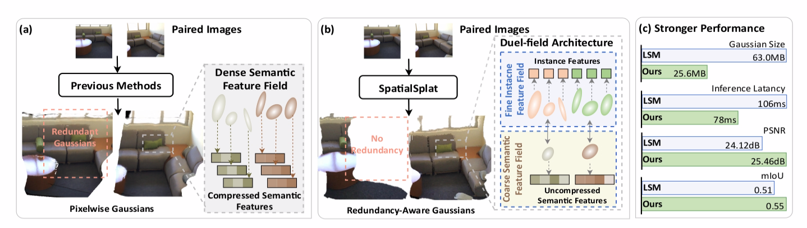

<p align="center">
  <h2 align="center">SpatialSplat: Efficient Semantic 3D from Sparse Unposed Images</h2>
  <h3 align="center"> ICCV2025</h3>
  <p align="center">
    <a>Yu Sheng</a>
    ·
    <a>Jiajun Deng</a>
    ·
    <a>Xinran Zhang</a>
    ·
    <a>Yu Zhang</a>
    ·
    <a>Bei Hua</a>
    ·
    <a>Yanyong Zhang</a>
    ·
    <a>Jianmin Ji</a>
  </p>
  <h3 align="center"><a href="https://arxiv.org/abs/2505.23044">Paper</a> </h3>
  <div align="center"></div>
</p>
<p align="center">
  <a href="">
    
  </a>
</p>
<br>

<br>

<!-- TABLE OF CONTENTS -->
<details open="open" style='padding: 10px; border-radius:5px 30px 30px 5px; border-style: solid; border-width: 1px;'>
  <summary>Table of Contents</summary>
  <ol>
    <li>
      <a href="#installation">Installation</a>
    </li>
    <li>
      <a href="#pre-trained-checkpoints">Pre-trained Checkpoints</a>
    </li>
    <!-- <li>
      <a href="#camera-conventions">Camera Conventions</a>
    </li> -->
    <li>
      <a href="#inference">Inference</a>
    </li>
    <li>
      <a href="#acknowledgements">Acknowledgements</a>
    </li>
    <li>
      <a href="#citation">Citation</a>
    </li>
</ol>
</details>

## Installation
1. Clone SpatialSplat.
    ```bash
    git clone 
    cd SpatialSplat
    ```
2. Create Environment.
    ```bash
    conda create -n spatialsplat python=3.10
    conda activate spatialsplat
    ```
3. Install PyTorch.
    Check your CUDA version, then install the [matching PyTorch version](https://pytorch.org/get-started/previous-versions/).
4. Install Requirements
    ```bash
    pip install -r requirements.txt
    ```
5. Install Gaussian Rasterization
    ```bash
    cd diff_gaussian_rasterization_i
    pip install .
    cd ..
    ```
6. Install CLIP
    ```bash
    pip install git+https://github.com/openai/CLIP.git
    ```

## Pre-trained Checkpoints
You can download our models from [GoogleDrive](https://drive.google.com/file/d/1e4X0J_QyPQRFTLuta7gMrWUqVMf9vw_d/view?usp=drive_link)
By default, we assume the downloaded weights are stored in the `pretrained_weights` directory.

If you place the weights elsewhere, please update the `pretrained_weights` and `ckpt_path` fields in `./config/spatialsplat.yaml` accordingly.

## Inference
First, put arbitrary two images into the `./demo_data` folder.

Then, run the following command:
```bash
python -m infer
```

The visualization of the predicted semantic 3D scene will be save in `./output` directory in `.avi` format by default.

## Acknowledgements
This project is developed with several fantastic repos: [NoPoSplat](https://github.com/cvg/NoPoSplat), [LSeg](https://github.com/isl-org/lang-seg), [DUSt3R](https://github.com/naver/dust3r), and [CroCo](https://github.com/naver/croco). We thank the original authors for their excellent work.

## Citation

```
@article{sheng2025spatialsplat,
  title={SpatialSplat: Efficient Semantic 3D from Sparse Unposed Images},
  author={Sheng, Yu and Deng, Jiajun and Zhang, Xinran and Zhang, Yu and Hua, Bei and Zhang, Yanyong and Ji, Jianmin},
  journal={arXiv preprint arXiv:2505.23044},
  year={2025},
  url={https://doi.org/10.48550/arXiv.2505.23044}
}
```